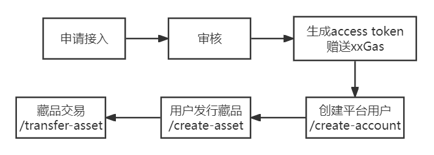

# 快速入门

## HTTP请求说明

### Base URL

https://www.bystack.com/api/v1

### HTTP通用返回格式说明

```
{
  "code": 200,
  "msg": "",
  "data": {}
}
```

|  参数   | 类型  | 说明 |
|  ----  | ----  | ----  |
| code  | int | 状态码 |
| message  | string | 状态信息 |
| data  | json object | 具体接口返回数据 |


## 接入流程



### 1、申请接入

请联系：miuzy@8btc. com进行申请

### 2、审核

申请后，将审核相关的信息

### 3、生成Access Token

审核通过后，可以生成Access Token，并赠送一定的Gas费用进行测试

每次调用API时，需将access token放在header中

```
{
  "Authorization": "Bearer access_token"
}
```

### 4、创建平台用户

调用/create-account接口, 创建平台用户，返回账户地址

**请求URL**

```
POST /create-account
```

**请求参数**

|  参数   | 类型  | 说明 | 是否必填 |
|  ----  | ----  | ----  | ----  |
| user_id  | uint64 | user_id跟bystack账户对应。一般为你们平台上的用户名（唯一） | 是 |

**返回值**

```
{
  "code": 200,
  "message": "",
  "data": {
    "address": "0x1d15a32E7BC025F150e5C462C2CA14c960fd896d"
  }
}
```

### 5、发行资产

为指定用户发行资产，资产发行到指定用户地址上

**请求URL**

```
POST /create-asset
```

**请求参数**

|  参数   | 类型  | 说明 | 是否必填 |
|  ----  | ----  | ----  | ----  |
| address  | string | 资产发行到该地址 | 是 |
| name  | string | 资产名称 | 是 |
| symbol  | string | 资产符号，一般为name的首字符缩写 | 是 |
| description  | string | 资产描述 | 否 |

**返回值**

```
{
  "code": 200,
  "message": "",
  "data": {
    "asset_id": "0x0b45Ad27866C8E05ED610cd8A0ec78de94B18202-b3"
  }
}
```