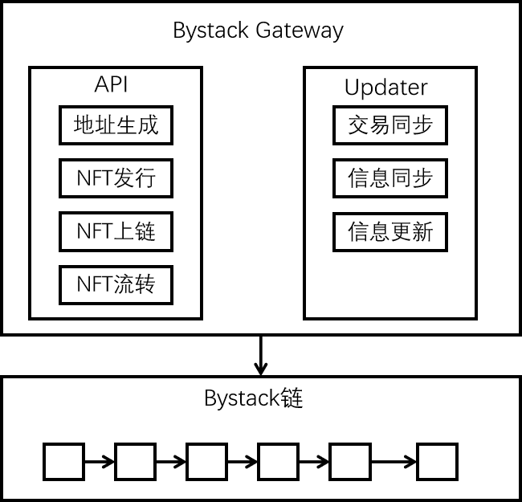

# Bystack Gateway

Bystack Gateway分为API接口和Updater两部分，API模块专门为外部业务提供接口，Updater用于和Bystack链进行信息交互：

地址生成：Gateway为用户在区块链上生成唯一标记，作为用户身份的辅助标记，同时用于用户NFT资产归属和流转。

NFT发行：Gateway帮助项目通过Bystack在链上生成唯一对应的资产。 

NFT上链：所有的NFT信息都会上链（包括图片哈希值），利用区块链防篡改的特性，链上的信息为司法取证提供了非常可靠的证据。同时Bystack与杭州公证处，杭州市互联网法院打通，后期可为创作者提供一站式公证和维权服务。

NFT流转：NFT流转都会对应于区块链上的交易，交易不可篡改，可追随，公开。

交易同步：Gateway将业务的交易信息同步到链，并将上链状态同步给业务方

信息同步：Gateway将业务的信息上链，同时将上链状态同步给业务方

信息更新：Gateway对业务更新信息上链，同时将上链状态同步给业务方