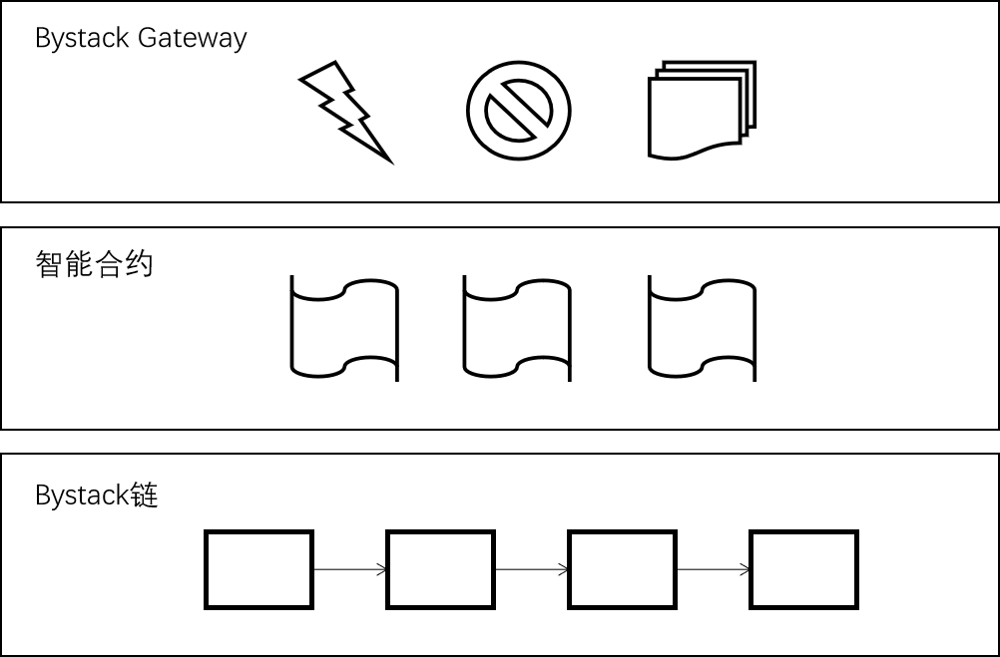

# Overview

## Bystack分层

Bystack主要分为三层，底层链，智能合约和Bystack Gateway。

Bystack链：依赖于一个由10个活跃验证者组成的系统，该系统具有权益证明共识，可以支持较短的出块时间和较低的费用。质押最多的验证者候选者将成为验证者并产生区块。双签检测和其他罚没逻辑保证了安全性、稳定性和链的最终性。

智能合约：Bystack支持与 EVM 兼容的智能合约和协议，支持所有现有的以太坊工具，以及更快的最终确定性和更便宜的交易费用。

Bystack Gateway：Bystack网关主要是针对不同的业务和项目开发的中间件，可以屏蔽底层区块链的细节，让业务方可以更快的接入Bystack

